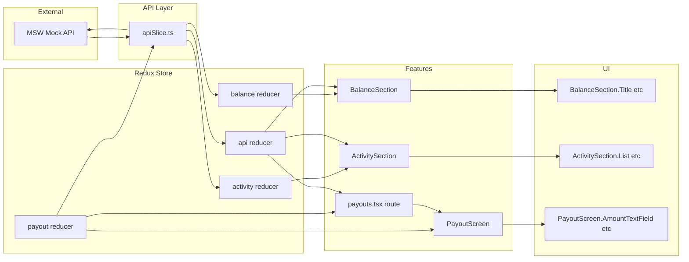
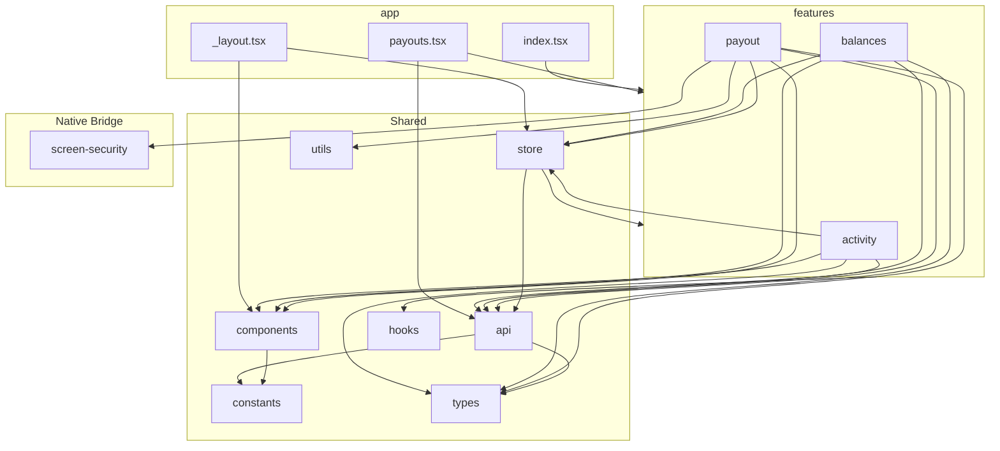
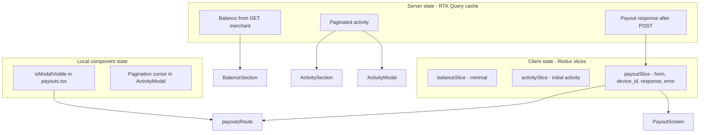
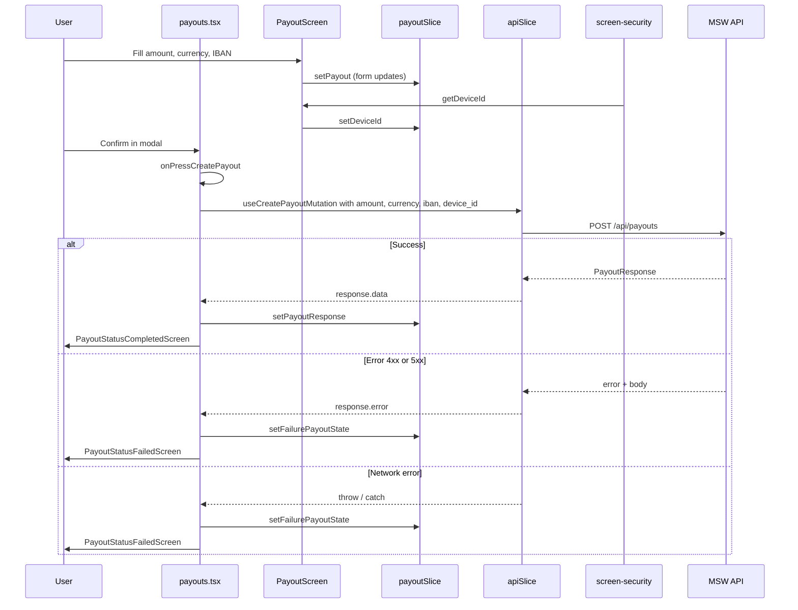
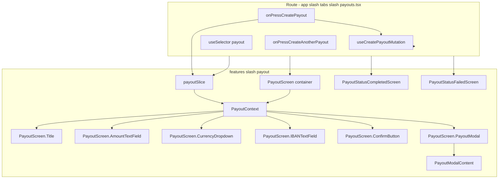
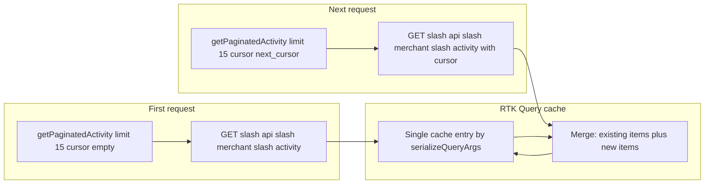
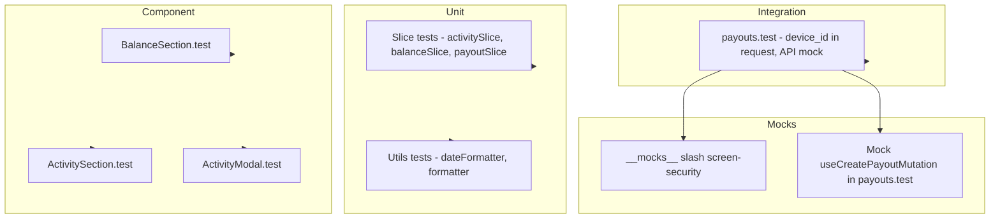
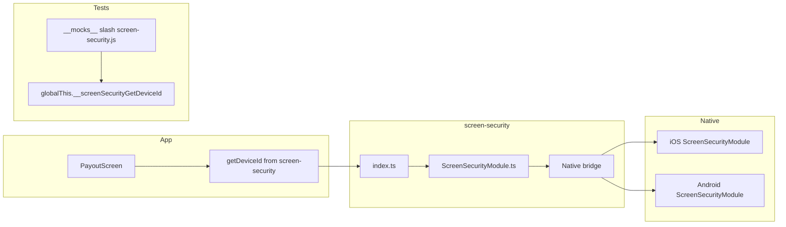

# Architecture Diagrams — Coding Defense Support

Mermaid diagrams to explain data flow, module boundaries, and key flows during your challenge evaluation.

---

## 1. Data Flow: API → Store → Features → UI

How data moves from the backend (MSW) through the app to the screen.

**Read flow:** MSW → apiSlice (RTK Query) → store (cache in `api`, client state in `balance`/`activity`/`payout`) → feature components → compound UI. **Write flow:** User action in UI → dispatch to slice or mutation → apiSlice → MSW.

---

## 2. Module Boundaries and Dependencies

What each area owns and what it is allowed to depend on.

**Rule of thumb:** `app` wires and composes; `features` depend on `api`, `store`, `components`, `types` (and `utils`/`hooks` where needed). Shared code does not import from features. `screen-security` is only used by the payout feature (and tests via mocks).

---

## 3. State Ownership: What Lives Where

Clarifies server state vs client state for the “why RTK Query + slices” discussion.

**Talking point:** "Server state lives in RTK Query cache; we don’t duplicate it in slices. Slices hold form data, UI-derived state, and post-submission result/error. Local state is for things that don’t need to be shared or persisted, like modal open/close."

---

## 4. Payout Flow Sequence (Critical Path)

End-to-end flow from user confirm to success/failure. Use this to defend the payout implementation.

**Talking point:** "Route owns the mutation call and error handling; it reads from the payout slice and dispatches result or failure into the slice so the status screens can render from the same state."

---

## 5. Feature Internal Structure (Payout Example)

How one feature is structured: slice, context, compound components, and route.

**Talking point:** "The route is the only place that calls the mutation and handles try-again / create-another. The feature owns the slice and the compound component tree; the context connects the slice to the compound children so we avoid prop drilling and keep a clear public API."

---

## 6. Activity Pagination and Cache Merge

How cursor-based pagination and RTK Query merge work together.

**Talking point:** "We use a stable cache key so all pages share one cache entry. The merge function appends new items to the existing list and updates next_cursor and has_more. That gives the modal one growing list for infinite scroll without managing pagination state in a slice."

---

## 7. Testing Strategy Layers

What is tested at which layer; useful to explain test choices.

**Talking point:** "We test slices and utils in isolation, feature components with RTL and real or mocked hooks, and the payout flow with the API and native module mocked so we can assert device_id and error handling without hitting real native or network."

---

## 8. Native Module Boundary

How the JS app uses the ScreenSecurity module and how tests replace it.

**Talking point:** "The app only imports the public JS API. The native module lives in screen-security and is required via Expo’s requireNativeModule. In tests we mock the module and control the return value so we can assert device_id in the payout request without running on a device."

---

## How to Use These in the Interview

1. **Data flow (diagram 1):** Use when they ask how data gets from the API to the UI or how you structured state.
2. **Module boundaries (diagram 2):** Use when they ask about folder structure or “why this dependency.”
3. **State ownership (diagram 3):** Use when they ask why you use both RTK Query and Redux slices.
4. **Payout sequence (diagram 4):** Use when they drill into the payout flow or error handling.
5. **Feature structure (diagram 5):** Use when they ask how a feature is organized (slice + context + compound components).
6. **Activity pagination (diagram 6):** Use when they ask about infinite scroll or cursor pagination.
7. **Testing (diagram 7):** Use when they ask how you test or what you mock.
8. **Native module (diagram 8):** Use when they ask about the device ID or native bridge and testability.

You can keep this file open or export the Mermaid to images and add them to a one-pager for quick reference during the evaluation.
